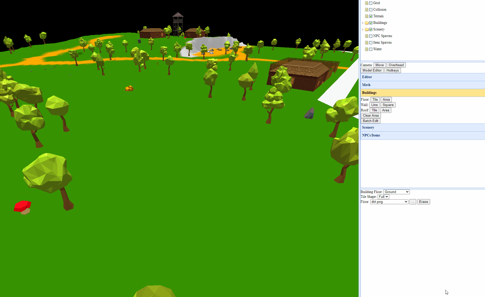

# genfanad-level-tools
This is a set of tools for editing Genfanad maps.

Genfanad is a brand new game based on classic games of the past. http://genfanad.com/ If you're interested in playing or developing for it, please come join our discord at https://discord.gg/uN3Vvsv

# Startup Guide
* Install Node (and npm). (https://nodejs.org/en/)
* Run the editor.
  * If you are on Windows, run (double-click) the 'start-windows.bat' file.
  * If you are on another OS, run 'node ./server/editor.js' in a terminal.
* Open the map editing tools in your browser. It defaults to http://localhost:7781/maps.html

# Feature Requests
* Currently tracked in this document: https://docs.google.com/document/d/1AWn1rXQP8D2rTjHtYPCMLJZhatd8wtkC0cmxE2kikh8/edit?usp=sharing
* Feel free to send PRs or bugs to the github as well.

# Editing Guide
## Workspaces
A workspace is a folder that is created under /tmp that contains all the information necessary for editing and using the map.

You can get started by extracting one of the sample ZIP files into the /tmp directory.

## Assets
Assets are model packs that are reusable across multiple workspaces. The format of an asset pack is a folder with:
* One or more shared textures as PNG files in the base asset directory.
* An OBJ folder that contains any number of OBJ-format models.

## General Editing
You can see a list of all current hotkeys using the 'Hotkeys' button.

## Layer selection
Different parts of the map can be toggled as layers.
* Grid: Overlays the map with a simple grid for easier positioning.
* Terrain: The terrain mesh (height+color).
* Buildings: Walls and second floors of any buildings.
* Buildings - Roofs: Allows you to look at interiors independently.
* Scenery: Models added to the map.
* NPC spawns / Item Spawns / Water: Not yet implemented.

## Tool Selection
The currently opened tool is visible in the toolbar at the top of the page.

The tools page is grouped by the type of operation that is being done. Editing the heightmap and colors are in the Mesh tab, while placing and editing models is in the 'scenery' tab.

## Features
### Undo/Redo (Ctrl-Z, Ctrl-Y)
Most commands are reversible using the Undo and Redo functionity. 

### Cut/Cut/Paste (Ctrl-C, Ctrl-X, Ctrl-V)
You can cut/copy/paste areas of the map.

### Copy/Paste to Clipboard (Shift-Ctrl-C, Shift-Ctrl-V)
This allows you to share data between workspaces by copying the selected data to the clipboard.

There is a selection buffer attached to each workspace which is populated by using cut or copy. That selection buffer can be loaded to your actual clipboard by using ctrl-shift-C. Then, that selection buffer can be loaded into another workspace by opening that workspace and hitting ctrl-shift-V, after which you can paste the data.

If there is content in one workspace that is not available in another (models, textures) then this may corrupt the target workspace.

## Tool Reference
### Default
#### Camera Move (Shift-M)
Does nothing on click, allows you to move the camera with click+drag while shift is pressed down.

#### Overhead (Shift-O)
Jumps the camera to an overhead view.

#### Model Editor (shift-P)
Opens the model editor. See the 'importing models' section at the bottom.

#### Hotkeys
Hotkeys are available for most tools. Click this for a quick references.

### Mesh
Mesh editing is provided by editing PNG files that represent that color and height maps.

"Save Color" will create 'color.png' in the workspace folder (The 'Open Editor' button will jump to it) and "Load Color" will replace the map with the contents of that file.

Height maps work similarly.

#### Height Brush (Shift-H)
Allows you to edit the height in the editor directly, although this is not recommended.

#### Flatten Area (T)
The flatten area will replace a square area with the average height on that area. It's useful for setting up a place for a house to be placed on.

### Buildings
These tools edit the texture of the ground. Tile/Line/Area let you choose whether drawing a specific tile, drawing a line on the map, or selecting a square. Building floor represents whether you're editing the ground, first floor, or second floor. Tile shape allows you to make half-tile segments (great for diagonal roads or houses). The actual dropdown allows you to choose which type of tile to draw.

#### Floor - Select Texture (Ctrl-Shift-F)
Opens a preview that shows the floor textures available.

#### Floors - Draw Tile (Shift-F)
Draws a single floor tile whenever clicked.

#### Floors - Draw Area (Alt-F)
Draws a square with the same floor tile.

#### Wall - Select Texture (Ctrl-Shift-W)
Opens a preview that shows the wall textures available.

#### Wall - Draw Line (Shift-W)
Draws a wall from one point to another.

Line and Area tools offer a vertical cursor to help you align everything.

#### Wall - Draw Area (Alt-W)
Draws walls in a square.

#### Roof - Select Texture (Shift-R)
Opens a preview that shows the roof types available.

#### Roofs - Draw Tile
Draws a single roof tile whenever clicked.

#### Roofs - Draw Area (Alt-R)
Draws a square with the same roof tyoe.

#### Clear Area (Shift-Q)
This will delete all buildings in the selected rectangular area.

### Scenery
This allows you to modify the 3D models in the map.

#### Select (S)
Choose this tool and you can click on existing scenery in the map. When you click on it, you can rotate the individual models, change the tint, or delete the scenery entirely.

You can click "Copy" to enter placement mode with the same model that is selected.

#### Place (P)
Placement mode allows you to click a tile to place the selected model in that tile.

#### Visual Selection (Shift-P)
By hitting '...' or Shift-P, you can see previews of all models that are loaded in the current workspace. Clicking on one will select it for use.

Whenever you place scenery or select it with this tool, it will be placed in the 'recent scenery' list at the top of this menu, for convenience.

This takes a while to generate the preview but will cache them in the `models/preview/s` folder.

#### Batch Edit
This tool allows you to edit many models at once, but converting a subset of scenery back and forth between image/JSON files. The tools will only apply to scenery where the ID matches the prefix.

Scenery is saved to 'batch-scenery.png' and 'batch-scenery.json'. Each scenery type will get a unique color (specified in batch-scenery.json) and a PNG will be generated with a pixel for each color. You can draw more of existing pieces of scenery and they will be added to the map with the 'load' tool. Similarly, deleting scenery in bulk can be done as well.

Tints are saved to 'tints.png' and can be used to recolor large parts of the map, like the dark forest.

Random rotation will rotate all scenery that matches the prefix randomly, exactly as it says.

## Model Editor (Shift-P)
When you choose the model placement tool, you can click '...' to enter the model editor.

The model editor has a file selection on the left that allows you to browse asset packs and existing model definitions. The workflow is to pick an asset, make sure it's positioned to fit within a map tile, then save it as a model definition.

The scale/translate/rotate buttons will change what the mouse does and pop up controls to visually transform the model. The camera button will revert the mouse back to moving the camera.

The other buttons in the editing page will try to reposition and stretch the model based on parameters. Resize 'fit' will scale it so that the model is fully contained with the tile box. ABS will set the scale to the number chosen. % will multiply the current scale by the number chosen. Reposition origin will move the model back to the default location. Reposition tile center will try to compute a bounding box and move the model to the center of the tile. X and Z will try to align the model with the X and Z axes.

You can hit 'close and select' to go back to the placement page with the currently selected model being chosen to place.

## Miscellanea
* "Open Folder..." will open the currently opened workspace in your OS file editor. This is a convenience for copying files back and forth.

# Suggested Workflow
This tool is primarily for viewing and editing buildings. Other tools will likely be better for making maps from scratch.

Generally, the process I would follow to create a new map is:
0. Create a new workspace.
1. Create a heightmap using an external tool (I use Gimp, but any image editor or heightmap editor should work) and import it.
2. Color the height map using an image editor and import it into the editor.
3. Block out large parts (buildings, rivers, unique models, fences) of the map in the color map using bright pink.
4. Place buildings (walls, roofs, textures) on the block-out, flattening as needed.
5. Draw paths using the 'batch edit floors' tool.
6. Place unique scenery on the map using the scenery editor tools.
7. Place trees on the map using the scenery batch-edit tools. A bright blue (0,0,255) pixel will place a random "regular" tree model if you've copied the models from a sample map.
8. Place all other models on the map by picking with the model editor and clicking on each tile.
9. Import additional models from the asset packs as needed. 
10. Save the workspace as a ZIP and send it to whoever needs it.

# License
MIT on the code. Assets provided in example maps are owned by their original creator.